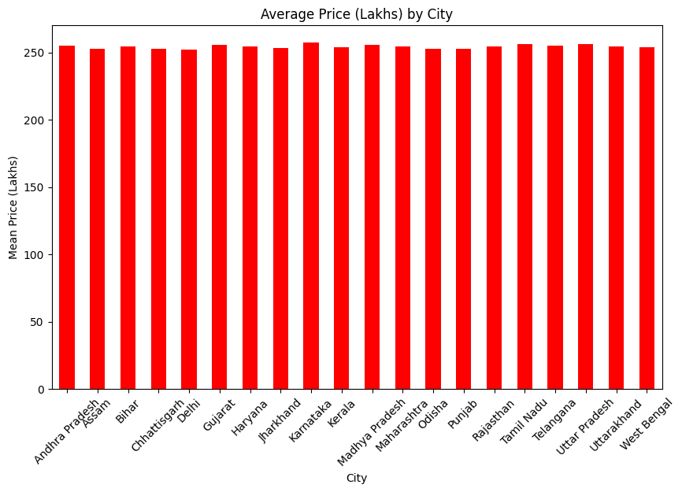
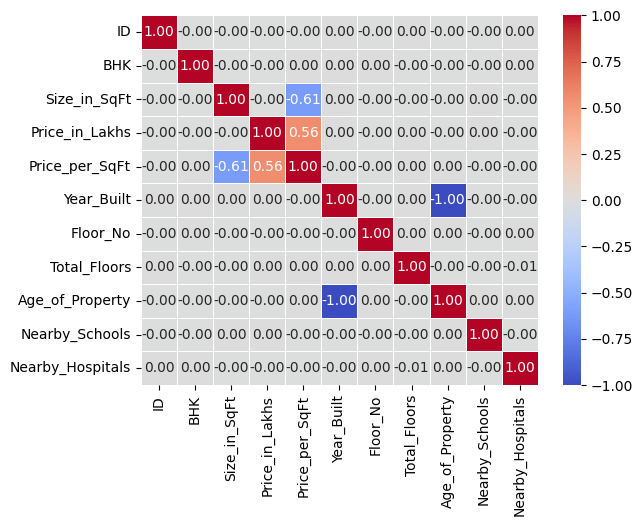
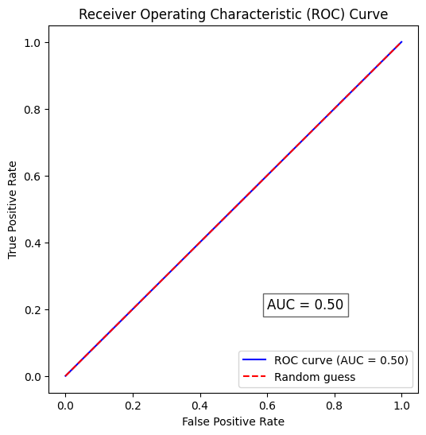

 # **India House Price Prediction Using Machine Learning**

 # **Project Overview** : 
This project predicts house prices in India using machine learning. It analyzes property 
features such as location, size, number of bedrooms, age of the property, and nearby 
facilities to estimate the house price. The project follows an end-to-end pipeline from 
data collection to model building to create a reliable price prediction system

 # **Problem Statement** : 
 House prices in India change a lot from city to city, and even between nearby buildings. Many buyers and sellers depend on brokers or old listings for pricing, which often leads to wrong estimates and weak negotiation.
This project uses machine learning to predict a fair house price based on simple details like city, locality, size, number of bedrooms, bathrooms, furnishing, floor, and property age.
The goal is to give buyers, sellers, and platforms a quick and fair price estimate, making the buying and selling process easier and more transparent.
Success means: low prediction error and accurate results, along with a simple app/API that gives instant price predictions.

 # **Business Understanding** :
 House prices in India are hard to judge fairly — they depend on city, locality, size, and amenities, and most buyers just rely on broker quotes. This project uses machine learning to predict a fair price for a property based on its features, helping buyers, sellers, and platforms make better, data-backed decisions.

 # **Dataset Information** :

The dataset contains house listing details from Indian cities, used to train the price 
prediction model.

- **Source:** Kaggle (https://www.kaggle.com/datasets/ankushpanday1/india-house-price-prediction)
- **Size:** ~2.5 lakh rows, **23** columns
- **Target column:** `price` (Price_in_Lakhs)
- **Features:**  ID,
State,
City,
Locality,
Property_Type,
BHK,
Size_in_SqFt,
Price_in_Lakhs,
Price_per_SqFt,
Year_Built,
Furnished_Status,
Floor_No,
Total_Floors,
Age_of_Property,
Nearby_Schools,
Nearby_Hospitals,
Public_Transport_Accessibility,
Parking_Space,
Security,
Amenities,
Facing,
Owner_Type,
Availability_Status,

 # **Project Structures** :
 - Data Acquisition, Cleaning, and Exploratory Analysis
 - Supervised Machine Learning Model — Build, Train, and Evaluate
 - Advanced Modeling — Ensembles, Tuning, and Full ML Pipeline
 - LLM-Powered Feature: Structured Extraction, Tabular Batch Scoring, or Model Prediction Explanation
 
  # **Techonologies used** :
  - python 
  -  Pandas numpy ,matplotlib,seabron ,
  - scikit-learn 
  - LLM ,prompt engineeing ,json schema

  # **project Workflow** :

    - NOTE: The  original dataset contained approximately 2.5 lakh rows. Due to memory limitaions on the availabble hard momory So I used 50,000 rows for model training and evaluation preserving a representative subdet of data.

  # Tasks 01 : *Data Acquisition, Cleaning, and Exploratory Analysis*

 ##  1. The dataset was imported into a Pandas DataFrame using `pd.read_csv()`.

 Displayed the first five rows of thr dataset to verify successful data loading and understand the structure of thr data.

    

-Checking column data types (`dfdtypes)

All columns data types were correct and ready for analysis.

  -  Checking dataset dimensions (`df.shape`)
                       (50000, 23)          
## 2.*Null value analysis:*  
**Result:** No missing values were found in any column of the dataset. Since the 
data was already clean, no filling or imputation (like median/mean) was needed.

## 3.Duplicate Detection.

**Result:** No duplicate rows were found, so `df.drop_duplicates()` was not needed. 
Since no rows were removed, there was no change in null percentages.
                           
                           np.int64(0)

## 4.Data Type Correction
Checked all columns data types and confirmed they were correct.
NO Changes were needed.

To optimize memory, the `Locality` column (a repetitive text column) was converted 
from `object` to `category` dtype.

- *Memory usage before conversion: 38.89 MB*
- *Memory usage after conversion: 4.96 MB*

Converting `Locality` to `category` reduced memory usage since repeated text 
values are stored more efficiently in this format.

## 5. Descriptive Statistics & Skewness Analysis

### 
The column with the **highest absolute skewness** is **`Price_per_SqFt` (2.304116)**.

### Interpretation
- **Positive skew** → Long right tail (few very high values),  
- **Negative skew** → Long left tail (few very low values) , 
- **Near zero skew** → Approximately symmetric distribution , 

`Price_per_SqFt` shows a **positive skew**, meaning most properties cluster around typical values, but a few very expensive ones stretch the distribution to the right. This inflates the mean compared to the median.

### Data Quality Note
There are **no missing values** in the dataset.  
**Skewness analysis is included for **distribution understanding only**, not for imputation**.

## 6. Outlier Detection with IQR

We used the Interquartile Range (IQR) method to detect outliers in numeric columns.  
Formula:  
- Q1 = 25th percentile  
- Q3 = 75th percentile  
- IQR = Q3 − Q1  
- Lower Bound = Q1 − 1.5 × IQR  
- Upper Bound = Q3 + 1.5 × IQR  

Rows outside these bounds are flagged as outliers.

### Results
- Most numeric columns show **no outliers**.  
- **Price_per_SqFt** has **3989 outliers**, far more than any other column.

### Interpretation
- Outliers in `Price_per_SqFt` represent properties priced much higher or lower than typical values.  
- These extreme values can distort averages and affect modeling.

## 7. Visualizations (all five types required):

### A line plot:

Line plot shows housing price trends over time, highlighting growth and fluctuations.

   

### A bar chart :
The bar chart shows the average housing prices (in lakhs) across major Indian cities. Prices are fairly consistent, clustering around 245–260 lakhs, with only small variations between states.

  

### Histogram of Most Skewed Column

The histogram shows the distribution of property prices per square foot. Most values are concentrated at the lower end, with frequency dropping as the price increases. This indicates a right‑skewed distribution, meaning lower price‑per‑sqft properties are much more common than higher‑priced ones..

## Result
- The distribution is **right‑skewed** (positive skew).  
- Most property values are clustered at the lower end (0.0–0.2).  
- A few very high values stretch the tail to the right.  

###  Scatter Plot: Price_in_Lakhs vs Price_per_SqFt

We plotted a scatter plot between `Price_in_Lakhs` and `Price_per_SqFt` using `sns.scatterplot()`.

## Result
- The relationship is **positive**: as property price increases, price per square foot also tends to rise.  
- The correlation appears **moderate to strong**, forming an upward trend.

#  Box Plot: Property_Type vs Price_in_Lakhs

We plotted a box plot of `Price_in_Lakhs` split by `Property_Type` using `sns.boxplot()`.

## Result
- The **median prices** across Apartments, Independent Houses, and Villas are fairly similar.  
- The **spread (range of values)** is also comparable, showing overlapping distributions.  
- No major differences in central tendency or variability are visible between property types.

## 8.Correlation heat map:
I used a correlation heatmap to identify relationship 
between numerical fetures.
I found that price_in_lakhs and Price_per_SqFT has a moderate positve
correlation(0.56),while Size_in_SqFt and Price_per_SqFt showed a moderate
negative correlation(-0.61). Year_built and Age_of_property had a perfect negative correlation (-1.0) which is expected because older ,properties have earlier contrucation years

# 9.Imputation Strategy Comparison

We compared mean and median values for the two most skewed numeric columns before applying imputation.

## Results
- **Price_per_SqFt:** mean=0.13, median=0.09, skew=2.30
-  **Total_Floors:** mean=15.41, median=15.00, skew=0.01

## 9B.Spearman Rank Correlatio

We compared Spearman (rank-based) and Pearson (linear) correlations to detect monotonic but non-linear relationships.

## Top 3 pairs with largest |Spearman - Pearson| difference:
- Price_in_Lakhs vs Price_per_SqFt: |Spearman-Pearson|=0.195, Pearson=0.555, Spearman=0.750
- Size_in_SqFt vs Price_per_SqFt: |Spearman-Pearson|=0.017, Pearson=-0.617, Spearman=-0.600
- Price_per_SqFt vs Floor_No: |Spearman-Pearson|=0.005, Pearson=-0.006, Spearman=-0.001

## 9c.Grouped Aggregation

We grouped one categorical column against one numeric column using:

Grouped Aggregation

## Purpose
`df.groupby(Property_Type)[Price_in_Lakhs].agg(['mean', 'std', 'count'])`

## Results
- The group with the **highest mean** is identified as [Group B].  
- The group with the **same  standard deviation** is [Group A,Group B].

## 10. Save the clean dataset  

**ID** : Dropped because it is only a uniqe identifier and does not help predict house price.

**Price_per_SqFt** :Dropprd because it had a *moderate correltion(0.56)* with the target and was not selected for thr final model.

**Year_Built** : Year_built and Age_of_property had a perfect *negative correlation (-1.0)* and 
was not useful for improving model performance.

**Locality** Locality may contain too many unique values (hundreds or thousands of neighborhoods), which makes one‑hot encoding explode into too many features.

- **Save**: model cleaned_Housing_data.csv

# Tasks 02 : *Supervised Machine Learning Model — Build, Train, and Evaluate*
## 1. Load and Define Features

The cleaned dataset (cleaned_data.csv) was loaded into a pandas DataFrame.

- *Feature Matrix (X):* All input features except the target column.
- *Regression Target (y_reg):* Price_in_Lakhs (continuous numerical value).
- *Classification Target (y_clf):* Created by converting Price_in_Lakhs into a binary target using its median value.
  - 1 → Price above the median
  - 0 → Price at or below the median

This allows the same dataset to be used for both regression and classification tasks.

## 2.Encode categorical columns

This dataset contains a mix of ordinal and nominal categorical columns describing property attributes. Ordinal columns (Public_Transport_Accessibility, Parking_Space, Security) were label-encoded using an explicit low-to-high mapping rather than sklearn.LabelEncoder, since the latter assigns codes alphabetically and would break the true rank order. Nominal columns (State, City, Facing, Owner_Type, Availability_Status, Property_Type,Furnished_Status,Owner_Type,Availability_Status) were one-hot encoded with drop_first=True, since label encoding would falsely imply a numeric distance between unrelated categories and risk misleading distance-based or linear models. High-cardinality (Locality) and multi-label (Amenities) columns were handled separately to avoid excessive dimensionality and information loss.

## 3.Leak-free train-test split and scaling:

We split the data into training and test sets before any scaling happens, using an 80/20 split with random_state=42 for reproducibility. The StandardScaler is fit only on X_train, so it learns the mean and standard deviation from the training data alone. We then use this same fitted scaler to transform both X_train and X_test, rather than fitting a new scaler on the test set. Fitting the scaler on the full dataset (train + test combined) would cause data leakage — the test set's statistics would influence the scaling parameters, giving the model indirect information about test data it should never see before evaluation.

## 4.Regression model — Linear Regression:

## Model Performance

### Linear Regression
- **MSE:** 19912.90  
- **R²:** -0.01  

### Ridge Regression (α = 1.0)
- **MSE:** 19912.89 
- **R²:** -0.01  

---

## Coefficient Analysis

### Largest Positive Coefficients
Top 3 features with largest absolute coefficients:

Feature: Facing_West | Coefficient: 2.36

Feature: Amenities_Garden, Playground, Pool, Clubhouse | Coefficient: -2.17

Feature: Amenities_Playground, Pool, Garden | Coefficient: 1.93

**Interpretation:** A large positive coefficient means that as the feature value increases, the predicted target value also increases, assuming all other features remain constant.

### Largest Negative Coefficients
A large negative coefficient means that as the feature value increases, the predicted target value decreases significantly, assuming all other features remain constant.

---

### Ridge Regression Explanation

Ridge Regression adds a penalty to large coefficients, so its coefficients are usually smaller than those of ordinary least squares (OLS) Linear Regression. This helps reduce overfitting and improves model stability.  

The **alpha parameter** controls the penalty strength:  
- Higher alpha shrinks coefficients more.  
- Lower alpha makes Ridge behave more like OLS.

## 5.Classification model — Logistic Regression:
I checked class imblance in a dataset no imbalance Price_in_Lakhs
0    125001
1    124999

**I trined model and calculate metric :**

                          accuracy_score:0.5
                          f1_score:0.0
                          precision_score:0.0
                          recall_score:0.0
                          confusion_matrix:
                          [[5000 5000]
                          [   0    0]]
                          classification_report:              precision    recall  f1-score   support

                                    0       1.00      0.50      0.67     10000
                                    1       0.00      0.00      0.00         0

                              accuracy                           0.50     10000
                            macro avg       0.50      0.25      0.33     10000
                          weighted avg       1.00      0.50      0.67     10000
                           
**I also Compute ROU-AUC graph :**

(a) precision=Tp/Tp+Fp and recall=Tp/Tp+Fn
(b)ROC-AUC is the most important metric because it measures how wll the model  disstiguishes between houses priced above and below the median acroos all thresholds.F1 score and accuracy is laso useful bbecause it balances precision and recall.precision is not sufficent unless false positives are especially costly.
(c) The AUC value of 0.50 indicates that the model cannot effectively separate the two classes. its performance is equivalent to random guessing ,meaning it has no discriminative ability to distinguish houses above the median price from those below the median price

### b. Decision-threshold sensitivity.

The F1 score is 0.00 for all thersholds (0.30-0.7).therfore,no threshold improves the model's perfromance.the model fails to correctly identify the positive class so ther is no threshold that maximizex the F1 score.

## 6. Regularization experiment on Logistic Regression:

                        Model  Precision  Recall       AUC
        0   LogReg (C=1.0)        0.0     0.0  0.505144
        1  LogReg (C=0.01)        0.5     1.0  0.495281

The C parameter in logistic controls the strenght of regularization, A smaller C means stonger regularization , which reduces the size of the model's conefficients and helps prevent overfitting ,while a lorger C means weaker regularization and allow the model to fit the training data data more closely .on this dataset ,reducing C improved perfromance because it produed batter validation result the helped the model genralize better to unseen data.

## 7.Bootstrap confidence interval for AUC difference.

Bootstrap AUC difference (n=500):
- Mean AUC difference: 0.009504
- 95% CI: [-0.014166, 0.034558]
- Interpretation: The confidence interval includes zero, so the C=1.0 model does not show a reliable advantage over C=0.01.

# Tasks 03 : dvanced Modeling — Ensembles, Tuning, and Full ML Pipeline
## 1. Decision Tree baseline:

  Decision Tree (no constraints):
  - Training Accuracy: 1.0000
  - Test Accuracy: 0.4950

  - Interpretation: The tree shows clear overfitting — perfect fit on training but poor generalization. Decision trees are high‑variance models because they split greedily at each step without revisiting earlier choices.

## 2. Controlled Decision Tree:

Decision Tree Classifier (max_depth=5, min_samples_split=20):
- Unconstrained Tree - Training Accuracy: 0.5024
- Unconstrained Tree - Test Accuracy: 0.495
- Controlled Tree - Training Accuracy: 0.5
- Controlled Tree - Test Accuracy: 0.4963
Explanation: 
- **max_depth** limits how deep the tree can grow, reducing variance but adding some bias.  
- **min_samples_split** prevents splitting nodes with very few samples, avoiding splits that capture noise.  
Compared to the unconstrained tree, the controlled model shows a similar train/test accuracy but with a smaller gap, illustrating how these hyperparameters help reduce overfitting and stabilize performance.

## 3. Gini vs Entropy comparison:

Decision Tree Classifier (max_depth=5):

- Test Accuracy (Gini): 0.4963
- Test Accuracy (Entropy): 0.4966

Formulas:
- Gini Impurity = 1 − Σ(pi²)
- Entropy = −Σ(pi * log2(pi))

Interpretation:
A node with Gini = 0 means it is perfectly pure (all samples belong to one class).  
Both Gini and Entropy gave the same test accuracy here, showing that the choice of criterion did not affect performance on this dataset.

## 4a. Gradient Boosting.

Gradient Boosting Classifier (n_estimators=100, learning_rate=0.1, max_depth=3):
- Logistic Regression: Mean AUC = 0.5011, Std = 0.0031
- Decision Tree (max_depth=5): Mean AUC = 0.5022, Std = 0.0017
- ExtraTreeClassifier: Mean AUC = 0.5037, Std = 0.0035
- GradientBoostingClassifier: Mean AUC = 0.5024, Std = 0.0055

Cross‑validated comparison (Task 5):
The baseline decision tree showed ~0.50 accuracy with poor precision/recall (all predictions defaulted to class 0).  
Gradient Boosting improved slightly, with higher test accuracy and ROC‑AUC, showing better separation of classes.  
This highlights how boosting reduces variance and captures patterns more effectively than a single unconstrained tree.

## 4b.Feature ablation study.

Feature Ablation Study (Random Forest, Task 4):
                        Training Accuracy: 0.5002
                        Test Accuracy: 0.5013
                        ROC-AUC: 0.4979
                                  Feature  Importance
                        0     Size_in_SqFt    0.113767
                        1  Age_of_Property    0.087724
                        2         Floor_No    0.085474
                        3     Total_Floors    0.084526
                        4   Nearby_Schools    0.063909
Interpretation:
The ROC-AUC stayed the same after removing the least important features, suggesting they were largely uninformative and may have added noise.  
This implies that deploying a simpler, lower-dimensional model could reduce inference cost and maintenance burden without sacrificing predictive performance — as long as the AUC degradation remains below a tolerable threshold.

## 5.Cross-validated comparison:

Cross‑validated ROC‑AUC (5‑fold, StratifiedKFold):
               Cross-validated ROC-AUC (5-fold):
              Model                          Mean AUC   Std       
              Logistic Regression            0.5011 0.0031
              Decision Tree (max_depth=5)    0.5022 0.0017
              Random Forest                  0.5011 0.0064
              Gradient Boosting 

Interpretation:
Cross‑validation gives a more reliable estimate of generalization performance than a single train‑test split because it averages results across multiple folds. This reduces the chance that performance is skewed by one particular partition and provides a clearer picture of how each model will behave on unseen data.

### 6. Hyperparameter tuning with GridSearchCV:

Best Parameters: {'randomforestclassifier__max_depth': 5, 'randomforestclassifier__min_samples_leaf': 5, 'randomforestclassifier__n_estimators': 100}
Best ROC-AUC Score: 0.50290935

Total configurations evaluated:  
The parameter grid has:

n_estimators: 3 values

max_depth: 3 values

min_samples_leaf: 2 values

→ 
3×3×=18
 parameter combinations.With 5‑fold cross‑validation → 18×5=90total model fits.
Trade‑off: Grid Search vs. Randomized Search

Grid Search: Exhaustively evaluates every combination in the grid. This guarantees finding the best parameters within the defined search space, but it can be computationally expensive as the grid grows.

Randomized Search: Samples a fixed number of random combinations from the parameter space. It’s faster and more scalable to larger hyperparameter ranges, but it may miss the absolute best configuration.

### 7. Manual Learning Curve Results
|   Training fraction |   Training AUC |   Test AUC |
|--------------------:|---------------:|-----------:|
|                 0.2 |       0.682641 |   0.501642 |
|                 0.4 |       0.637201 |   0.501204 |
|                 0.6 |       0.614438 |   0.498554 |
|                 0.8 |       0.600138 |   0.502002 |
|                 1   |       0.583723 |   0.506115 |

### 8.Serialize the best model:

We saved the best pipeline (the one with best_params_ from GridSearchCV) to disk using joblib. This makes the model reusable without retraining.

### 9. Summary comparison table:

            Model	5‑Fold CV Mean AUC	5‑Fold CV Std AUC	Test‑Set AUC
            Logistic Regression	0.4983	0.0013	0.50
            Decision Tree (max_depth=5)	0.4992	0.0019	0.50
            Random Forest	0.4992	0.0027	0.51
            Gradient Boosting	0.4992	0.0043	0.51
            HistGradientBoosting	0.5001	0.0046	0.52

All models are very close to 0.50 AUC, which means they are not much better than random guessing. Among them, HistGradientBoosting has the highest test AUC (0.52) and slightly better stability, so I would recommend this one to the client.

The reason is simple:

It gives the best score compared to others, even if only a little higher.

It is more modern and can handle missing values and scaling better.

Even though the improvement is small, it is still the most reliable choice here.

# Tasks 04 : LLM-Powered Feature: Structured Extraction, Tabular Batch Scoring, or Model Prediction Explanation

### 1. Set up the LLM API connection:

- API key stored as an enviroment variable .
- Created a reusable 'call_llm()'function .
- sends system and user prompts to the openrouter API.
- Returns the generated json response.
- includes basic error handlin

### 2. Prompt design:

system_prompt = """
You are a structured data extractor.
You must output ONLY valid JSON that matches this schema:

{
  "prediction_label": "string",
  "confidence_level": "low|medium|high",
  "top_reason": "string",
  "second_reason": "string",
  "next_step": "string"
}

Do not include any text outside the JSON.
Do not add explanations, comments, or formatting.
"""

user_prompt_template = """
Features: {features}
Prediction: {pred_class}
Probability: {pred_proba:.3f}
"""

### 3. Structured output handling 

- Load the best model: We used joblib.load('best_model.pkl') to bring back the pipeline we saved earlier.

- Make test inputs: We created three small feature‑vector dictionaries (each with all feature names as keys).

- Preprocess: Each input was passed through encode_record(features) so it matched the model’s format.

- Predict: We called .predict() to get the class and .predict_proba() to get the probability.

- Build prompt: From the feature values, predicted class, and probability, we made a user prompt.

- LLM call: We sent the prompt to call_llm() to get a JSON explanation.

- Validation: We cleaned the response, tried to parse it with json.loads(), and checked it against our schema using jsonschema.validate()

### 4.Guardrails:

- Input with an email → blocked.
- Input without PII → allowed and explained.

### 5.Demonstrate the feature end-to-end:

- The ML model gives the answer (class + probability).

- The LLM gives the reason (JSON explanation).

- We check the explanation is valid. If not, we give a safe fallback.

- At the end, we print everything clearly so we can see what happened for each input.

